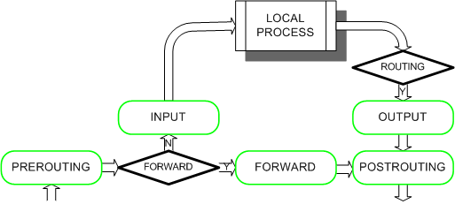

IPTables is a command-line interface (CLI) to the packet filtering functionality in netfilter. 

ITPables is a stateful firewall, which means that packets are inspected with respect to their `state`. 
For example, a packet could be part of a new connection, or it could be part of an existing connection.

# Definition
## Type of Tables
- `filter`: This is the default table that is used to make decisions about whether a packet should be allowed to reach its destination.
- `mangle`: This table allows you to alter packet headers in various ways, such as changing TTL values.
- `nat`: This table allows you to route packets to different hosts on NAT (Network Address Translation) networks by changing the source and destination addresses of packets.
- `raw`: This table allows you to work with packets before the kernel starts tracking its state.

## Type of Chains
- `PREROUTING`: Rules in this chain apply to packets as they just arrive on the network interface.
- `INPUT`: Rules in this chain apply to packets just before they’re given to a local process.
- `OUTPUT`: The rules here apply to packets just after they’ve been produced by a process.
- `FORWARD`: The rules here apply to any packets that are routed through the current host.
- `POSTROUTING`: The rules in this chain apply to packets as they just leave the network interface.

## Tables and Chains
The following diagram shows the flow of packets through the chains in various tables.



|Table|Chains|
|-----|------|
|`filter`|`INPUT`, `OUTPUT` & `FORWARD`|
|`mangle`|`PREROUTING`, `INPUT`, `OUTPUT`, `FORWARD` & `POSTROUTING`|
|`nat`|`PREROUTING`, `OUTPUT` & `POSTROUTING`|
|`raw`|`PREROUTING` & `OUTPUT`|

## Type of Targets (Actions)
- `ACCEPT`: This target *accepts* the packet.
- `DROP`: This target *drops* the packet. To anyone trying to connect to your system, it would appear like the system didn’t even exist.
- `REJECT`: This target *rejects* the packet. It sends a "connection reset" packet in case of TCP, or a "destination host unreachable" packet in case of UDP or ICMP.
- `RETURN`: This target *returns* the packet back to the originating chain so you can match it against other rules.

# Usage
## Parameters
|Short|Long|Definition|Example|
|:---:|:---|----------|-------|
|`-L`|`--list`|List rules|`iptables -L -v`|
|`-A`|`--append`|Append rules|`iptables -A`|
|`-I`|`--insert`|Append rules|`iptables -A`|
|`-C`|`--check`|Check rules|`iptables -C`|
|`-D`|`--delete`|Delete specified rules from a chain|`iptables -D INPUT 2`|
|`-F`|`--flush`|Remove all rules|`iptables -F`<br>`iptables -F INPUT`|
|`-s`|`--source`|Source Address|`iptables -A INPUT -s 1.1.1.1/24 -j DROP`|
|`-d`|`--destination`|Destination Address|`iptables -A OUTPUT -d 1.1.1.1-1.1.1.20 -j ACCEPT`|
||`--sport`|Source Port|`iptables -A INPUT -p tcp -s 0/0 --sport 513:65535 -j ACCEPT`|
||`--dport`|Destination Port|`iptables -A INPUT -p tcp -m tcp --dport 22 -s 1.1.1.1 -j DROP`|
|`-p`|`--protocol`|Protocol|`iptables -A FORWARD -p tcp -j REJECT`|
|`-i`||Input Interface|`iptables -A INPUT -i lo -j ACCEPT`|
|`-o`||Output Interface|`iptables -A OUTPUT -o wlan0 -d 1.1.1.1 -j DROP`|
|`-m`|`--match`|Match|see below|

### Matching Parameters
|Base|Parameter|Example|
|:---|:--------|-------|
|`-m state`|`--state [STATE]`|`iptables -A INPUT -p tcp -m state --state NEW,ESTABLISHED -j ACCEPT`|
|`-m iprange`|`--src-range [RANGE]`|`iptables -A OUTPUT -m iprange --src-range 1.1.1.1-1.1.1.20 -j ACCEPT`|
|`-m multiport`|`--dport [PORTS]`<br>`--sport [PORTS]`|`iptables -A INPUT -p tcp --match multiport --dports 80,22,53 -j ACCEPT`|
|`-m time`|`--timestart [TIME]`<br>`--timestop [TIME]`<br>`--days [DAYS]`|`iptables -A OUTPUT -p tcp -m time --timestart 09:00 --timestop 18:00 --days Mon,Thu,Fri -j ACCEPT`|

## Basic Commands
```bash
# list rules
iptables -L {EXTRA_PARAMETERS}
## possible additional parameters
##  -v                verbose
##  -n                no DNS lookup
##  --line-numbers    show the line number

# append (add) rules
# other parameters are the same; -D, -I, -R, etc.
iptables -A {CHAIN} -i {INPUT_INTERFACE} -m {MATCH_TERMS} -p {PROTOCOL} -s {IP_Address} --dport {DESTINATION_PORT} -j {TARGET}
```

### Examples
#### Basics
```bash
### show the line number (order) of the rule
iptables -L --line-numbers

### list rules verbosly without DNS lookup for a specific table and chain
iptables -t nat -vnL PREROUTING

### insert a rule to the first place of the INPUT chain
iptables -I INPUT 1 -s 1.1.1.1 -j ACCEPT

### delete 10th rules from the FORWARD chain
iptables -D FORWARD 10

### flush (delete) all rules in the NAT table
iptables -t nat -F

### drop (block) incomming connections from a specific interface
iptables -A INPUT -i eth0 -j DROP
```

#### Ports and Protocols
```bash
### open HTTP/TCP port
iptables –A INPUT –p tcp  ––dport 80 –j ACCEPT

### drop (block) incomming SSH/UDP & HTTPS/UDP ports from a specific IP
iptables -A INPUT -p udp -m multiport --dports ssh,https -s 1.1.1.1 -j DROP

### accept (allow) any outgoing SSH, HTTP & HTTPS ports
iptables -A OUTPUT -p tcp -m multiport --sport 22,80,443 -j ACCEPT

### accept (allow) any outgoing specific port range
iptables -A OUTPUT -p tcp -m multiport --sport 100:200 -j ACCEPT

```
##### Port Forwarding
To enable port forwarding, first run this command `sysctl -w net.ipv4.ip_forward=1` or `sysctl -w net.ipv6.ip_forward=1`.
```bash
### forward a port to a remote different port
iptables -t nat -A PREROUTING -p tcp --dport 333 -j DNAT --to-destination 1.1.1.1:222
iptables -t nat -A POSTROUTING -j MASQUERADE

### forward incomming ports range to a different port rane on different IP
iptables -t nat -A PREROUTING -p tcp --dport 100:300 -j DNAT --to 1.1.1.1:500-700
iptables -t nat -A POSTROUTING -j MASQUERADE

### forward multiple ports to a another IP (the same port)
iptables -t nat -A PREROUTING -p udp -m multiport --dports 80,443,2068,8192 -j DNAT --to-destination 1.1.1.1
iptables -t nat -A POSTROUTING -j MASQUERADE

### 
sudo iptables -A PREROUTING -t nat -p tcp --dport 443 -j DNAT --to 1.1.1.1:443
sudo iptables -A FORWARD -p tcp -m state --state NEW --dport 443 -j ACCEPT
sudo iptables -t nat -A POSTROUTING -j MASQUERADE
```

#### IP Address
```bash
### reject (block) an incomming IP range
iptables –A INPUT –m iprange ––src–range 1.1.1.1-1.1.1.15 -j REJECT

### reject (block) an outgoing IP CIDR
iptables -A OUTPUT -d 1.1.1.1/24 -j REJECT
```

# Save
```bash
# Debian-based
/sbin/iptables-save

# RedHat-based
/sbin/service iptables save

# Cross platform
/etc/init.d/iptables save
```
