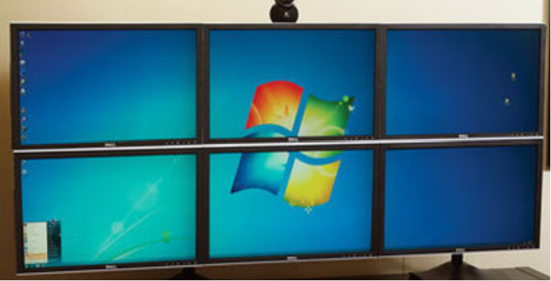

# Setting up RDP
## Enable RDP
```PowerShell
# Enable the remote desktop protocol
Set-ItemProperty -Path 'HKLM:\System\CurrentControlSet\Control\Terminal Server' -name "fDenyTSConnections" -value 0

# Enable remote desktop through the Windows Firewall
Enable-NetFirewallRule -DisplayGroup "Remote Desktop"
```

## Get the RDP port number
```PowerShell
# Get the RDP port
Get-ItemProperty -Path 'HKLM:\SYSTEM\CurrentControlSet\Control\Terminal Server\WinStations\RDP-Tcp' -Name "PortNumber"
```

## Change the RDP port number
```PowerShell
# Define the desired port number
$portvalue = 3390

# Change the port number
Set-ItemProperty -Path 'HKLM:\SYSTEM\CurrentControlSet\Control\Terminal Server\WinStations\RDP-Tcp' -Name "PortNumber" -Value $portvalue
```

## Let the RDP Port be Allowed in the Firewall
```PowerShell
# Get the RDP port number and save it in a variable
$portvalue = (Get-ItemProperty -Path 'HKLM:\SYSTEM\CurrentControlSet\Control\Terminal Server\WinStations\RDP-Tcp').PortNumber

# Allow TCP and UDP protocols of the RDP port in the firewall
New-NetFirewallRule -DisplayName 'RDPPORTLatest-TCP-In' -Profile 'Public' -Direction Inbound -Action Allow -Protocol TCP -LocalPort $portvalue
New-NetFirewallRule -DisplayName 'RDPPORTLatest-UDP-In' -Profile 'Public' -Direction Inbound -Action Allow -Protocol UDP -LocalPort $portvalue
```

# RDP & Microsoft Account Sign-In
When you want to use your Microsoft account to sign into your account, you cannot, as you need to activate it or create a local user and use that one. To enable your account, you need to open a program via PowerShell. Then, your RDP username will be `username@example.com` with your Microsoft password.
```PowerShell
# Activate the Microsoft account for using RDP
# Microsoft account is like: username@example.com
runas /u:MicrosoftAccount\<MICROSOFT_ACCOUNT> winver
```

# RDP Connection (`.rdp` file) Settings
You do not have access to all RDP connection settings in the GUI. Then, you must save it and change the `.rdp` file via an IDE. Here are the most important settings you can add or modify.
## Select monitors to show the RDP screen
```PowerShell
## Determines whether full screen or window RDP session
## The value `1` means window and `2` means full-screen
screen mode id:i:2

## Enable the multi-monitor feature
## You can enable multi-monitor feature by running the command `mstsc /multimon` or via the GUI's tab "Display"
use multimon:i:1
## Select which monitors are going to be used for RDP; in this case, 0 and 1 are selected.
## You can get the monitors' IDs by running the command `mstsc /l`
selectedmonitors:s:0,1
```
## Full-screen or Window RDP Session on Start-up
```PowerShell
## Determines whether full screen or window RDP session
## The value `1` means window and `2` means full-screen
screen mode id:i:2
```
## Snap Feature

```powershell
## Disable spanning across multiple monitors
span monitors:i:0
```


---
**Source:**
- https://www.donkz.nl/overview-rdp-file-settings/
